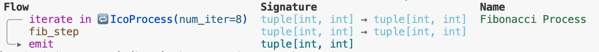
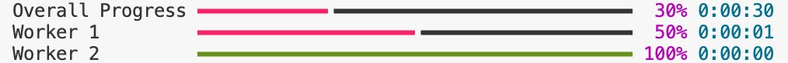

# ICO Framework
<div align="center">


*Transform complex ML code into elegant, type-safe, self-describable flows*

</div>

ICO formalizes a common ML pattern: take **Input**, apply **Context**, produce **Output**, and provides an elegant, type-safe, and fully-transparent framework for ML engineers and researchers.

## 🚀 Quick Demo

```python
from apriori.ico.core.process import IcoProcess

# Fibonacci as an iterative process
def fib_step(state: tuple[int, int]) -> tuple[int, int]:
    return (state[1], state[0] + state[1])

fib_process = IcoProcess(fib_step, num_iterations=8)
result = fib_process((0, 1))
print(result)  # (21, 34) - 8th Fibonacci number

```

## 🔥 Key Features

### 🔍 **Introspection and Rich Visualization**

ICO provides beautiful console visualization with a fully-defined signature for any operator:
```python
fib_process.describe()
```



### 🎯 **Declarative Elegance**
```python
# Complex workflows become simple
ml_pipeline = (
    load_train_data
    | augment_pipeline
    | train_epoch
    | save_checkpoint
)
```


### 🛡️ **Type Safety Everywhere**
```python
# Automatic type inference and validation
def square(x: float) -> float:
    return x * x

def to_str(x: float) -> str:
    return str(x)


# This works ✅
pipeline = square | to_str

# This fails at type-check time ❌
bad_pipeline = to_str | square
```


### ⚡ **Distributed by Design**
```python
# Multiprocessing with zero configuration
workers = IcoAsyncStream(
    lambda: MPAgent(heavy_computation),
    pool_size=cpu_count()
)

# Automatic work distribution and result collection
distributed_flow = data_source | workers | train
```

### 📊 **Built-in Progress Tracking**
```python
# Rich progress bars and metrics
progress = IcoProgress(name="Overall progress", total=epochs)
pipeline = source | progress | processing | train

# Real-time console updates with ETA, speed, etc.
```



## 📚 Use Cases

**Perfect for:**
- 🧠 **ML Training Pipelines** — Data loading, augmentation, distributed training
- 📊 **ETL Workflows** — Extract, transform, load with monitoring
- 🔄 **Stream Processing** — Real-time data processing with backpressure
- 🧪 **Research Experiments** — Reproducible, monitorable scientific computing
- 📈 **Data Analytics** — Complex data processing with visualization

## 🎯 Why ICO?

| Feature | ICO | Others |
|---------|-----|--------|
| Type Safety | ✅ Full static typing | ❌ Runtime errors |
| Visualization | ✅ Rich console integration | ❌ External tools needed |
| Distribution | ✅ Built-in multiprocessing | ❌ Manual setup |
| Composability | ✅ Pipe syntax `\|` | ❌ Complex APIs |
| Monitoring | ✅ Real-time state tracking | ❌ Limited introspection |

## 🚀 Getting Started

### 📖 Examples
- **Basic Introduction**: [Linear Regression with ICO](src/examples/linear_regression.ipynb)
- **Real ML Pipeline**: [CIFAR-10 Classification with ICO](src/examples/vision/cifar/complete_flow.ipynb) (with PyTorch DataLoader replacement)
- **Runtime Monitoring**: Runtime Monitoring with ICO Tools (comming soon)
- **Distributed Processing**: Multi-processing data pipeline (coming soon)


## 📈 Future Development

- 📊 Profiler: tools for time/memory metrics analysis
- 😎 Stateful run: State management API (pause/resume) to support distributed training scenarios on remote computation units
- 🌐 Live board: Real-time monitoring tool with web interface
**And much more!**

Start experimenting and create your own innovative ML pipelines! 🎯

## 🤝 Contributing

We welcome contributions! Contribution guidelines coming soon.

## 📄 License

MIT License - see [LICENSE](LICENSE) file for details.

---

<div align="center">

**Built with ❤️ for the ML community**

[Documentation](docs/) • [Examples](examples/) • [Discussions](discussions/)

</div>
