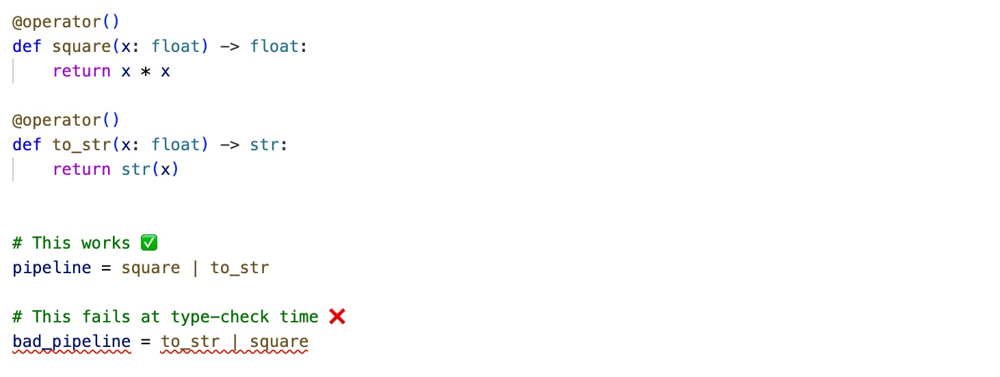

# ICO Framework
<div align="center">

[](https://github.com/apriori3d/ico/actions/workflows/ci.yml)

[](https://opensource.org/licenses/Apache-2.0)
[](https://github.com/astral-sh/ruff)


*Composable, type-safe ML pipelines with full runtime transparency*

</div>

ICO is a type-safe framework for building composable ML pipelines with built-in multiprocessing, progress tracking, and full runtime introspection.

It helps you replace complex, ad-hoc training and data processing code with clear, reusable, and debuggable flows.

At its core, ICO formalizes a simple pattern:

**Input → Context → Output**

Each step is a typed operator that composes into pipelines, runs locally or in parallel, and remains fully inspectable at runtime.

## 🚀 Quick Demo

```python
from apriori.ico.core.process import IcoProcess

# Fibonacci as an iterative process
def fib_step(state: tuple[int, int]) -> tuple[int, int]:
    return (state[1], state[0] + state[1])

fib_process = IcoProcess(fib_step, num_iterations=8)
result = fib_process((0, 1))
print(result)  # (21, 34) - 8th Fibonacci number

```

## 🔥 Key Capabilities

### 🔍 **Full Runtime Introspection**

Every operator and pipeline can be inspected at runtime:
```python
fib_process.describe()
```


You always know:
- what is running
- how data flows
- where failures occur

No more black-box pipelines.


### 🧩 **Composable Declarative Pipelines**
Build complex workflows from simple, reusable operators using a clean pipe syntax:

```python
ml_pipeline = (
    load_train_data
    | augment
    | train_epoch
    | save_checkpoint
)
```
No hidden control flow — the structure of your pipeline is explicit and readable.

### 🛡️ **End-to-End Type Safety**
All operators are fully typed (Input → Context → Output) and validated by static type checkers like mypy or Pylance.

This catches integration errors early and makes large pipelines easier to reason about.



### ⚡ **Built-in Multiprocessing**
Parallel execution is part of the core design — no need to rewrite your pipeline:
```python
workers = IcoAsyncStream(
    lambda: MPAgent(heavy_computation),
    pool_size=cpu_count()
)

pipeline = source | workers | train
```
The same pipeline scales from local execution to multi-process workloads.

### 📊 **Integrated Progress and Monitoring**
Track execution in real time with built-in progress and metrics:
```python
# Rich progress bars and metrics
progress = IcoProgress(name="Overall progress", total=epochs)
pipeline = source | progress | processing | train

```


Includes ETA, throughput, and structured execution state.


## 📚 Use Cases

### 🚀 PyTorch DataLoader Replacement
Build fully customizable, inspectable, and parallel data pipelines without the limitations of traditional DataLoader abstractions.

---

### 🧠 ML Training Pipelines
Structure end-to-end training workflows with clear, composable steps:
data loading, augmentation, batching, training, and logging — all in one pipeline.

---


### ⚡ Parallel Data Processing
Scale CPU-heavy preprocessing and feature extraction with built-in multiprocessing — without rewriting your pipeline.

---

### 🔄 Streaming and Online Processing
Build streaming pipelines with backpressure-aware execution and continuous data flow.

---

### 🧪 Research and Experimentation
Prototype and iterate quickly with fully transparent pipelines that are easy to inspect, modify, and debug.

---

### 📊 Data Transformation Workflows
Replace ad-hoc scripts with structured, traceable pipelines for complex data transformations.

## 🚀 Getting Started

### 📖 Examples

📓 Examples are provided as **Jupyter notebooks** and can be run instantly in Google Colab — no setup required.

#### 🎯 **ICO Basics**

- 📓 [Basic introduction to ICO approach](src/examples/ico_basics.ipynb) — Main building blocks and core concepts
  [](https://colab.research.google.com/github/apriori3d/ico/blob/main/src/examples/ico_basics.ipynb)

- 📓 [ICO Runtime introduction](src/examples/ico_runtime_basics.ipynb) — Progress monitoring, printing and runtime architecture
  [](https://colab.research.google.com/github/apriori3d/ico/blob/main/src/examples/ico_runtime_basics.ipynb)

---

#### 🔄 **Multiprocessing**
⚠️ Note: Multiprocessing examples cannot be executed in Jupyter or Google Colab. To run them, please install the framework locally and execute the scripts from a terminal.

See the [Installation](#-installation) section below for setup instructions.


- 🐍 [Multi-processing example](src/examples/ico_mp_basic.py) — Basic example of distributed computational flows

- 🐍 [Parallel Multi-processing Pool example](src/examples/ico_mp_basic_pool.py) — Distributed compute flows with parallel worker pools

---

#### 🧠 **Machine Learning**

- 📓 [Linear Regression](src/examples/ml/ico_linear_regression.ipynb) — ICO-based ML pipeline development
  [](https://colab.research.google.com/github/apriori3d/ico/blob/main/src/examples/ml/ico_linear_regression.ipynb)

- 📓 [CIFAR-10 Classification with validation](src/examples/ml/cv/cifar/ico_cifar_complete_flow.ipynb) — Complete CV pipeline replacing PyTorch DataLoader
  [](https://colab.research.google.com/github/apriori3d/ico/blob/main/src/examples/ml/cv/cifar/ico_cifar_complete_flow.ipynb)

- 🐍 [CIFAR-10 Classification with worker pools](src/examples/ml/cv/cifar/ico_cifar_complete_flow_mp.py) — Complete CV pipeline with parallel data processing workers


## ⚙️ Installation

### Using Poetry (recommended)

```bash
# 1. Install Poetry (if not installed)
curl -sSL https://install.python-poetry.org | python3 -

# 2. Clone repository
git clone https://github.com/apriori3d/ico.git
cd ico

# 3. Install dependencies
poetry install

# 4. Activate virtual environment
poetry shell
```

### Using pip (quick install)

```bash
pip install git+https://github.com/apriori3d/ico.git
```


## 📈 Future Development

### 🔮 Planned Features

#### 📊 ICO Profiler
Performance analysis for complex pipelines:
- Operator-level timing and bottleneck detection
- Memory usage tracking across workers
- End-to-end pipeline profiling
- Exportable reports for optimization

---

#### 🧠 Stateful Runtime
Robust execution for long-running workflows:
- Pause and resume pipeline execution
- Checkpointing and recovery after failures
- Reproducible runs across environments
- Designed for large-scale training workloads

---

#### 🌐 ICO Live Board
Real-time monitoring and visualization:
- Web-based pipeline visualization
- Live progress tracking across runs
- Resource monitoring (CPU, GPU, memory)
- Integration with Jupyter and ML tooling

---

### 🚀 **Community-Driven Roadmap**
We're building based on real ML engineer needs. Have ideas? [Join the discussions](https://github.com/apriori3d/ico/discussions) and help shape ICO's future!

Start experimenting and create your own innovative ML pipelines! 🎯

## 🤝 Contributing

We welcome contributions! Contribution guidelines are coming soon.

## 📄 License

Apache License 2.0 - see [LICENSE](LICENSE) file for details.

---

<div align="center">

**Happy Coding with ICO! ☺️**

[Documentation](docs/) • [Examples](examples/) • [Discussions](https://github.com/apriori3d/ico/discussions)

</div>
